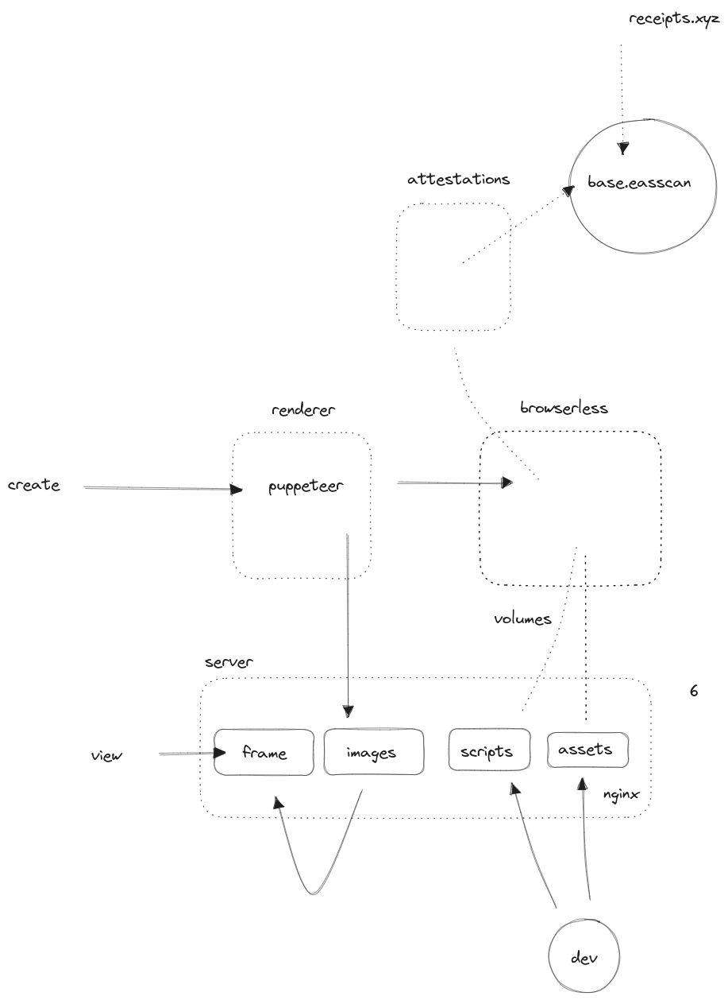

Server side rendering of images from farcaster frames. Typescript 'templates' can be added without recompiling, restarting containers. 

touch attestations/.env    
touch renderer/.env    
cd devops   
cp env.example .env   
nano .env (to add your local folder)   
( change domains in nginx/conf.d files )    
docker-compose up -d    

